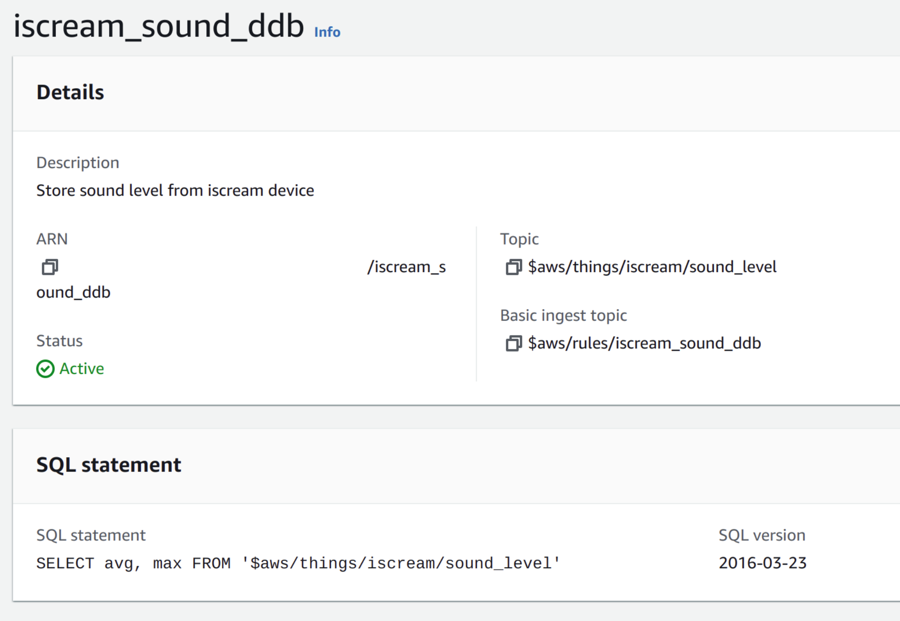
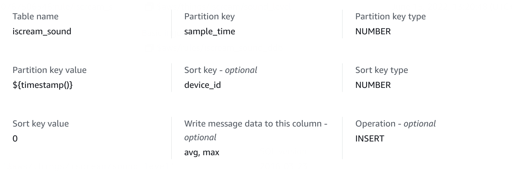

# iScream🍦

IoT alarm system with sound level triggering

# Hardware

The device is based around a [B-L475E-IOT01A
Discovery Kit](https://www.st.com/en/evaluation-tools/b-l475e-iot01a.html), an evaluation board with many peripherals. The main peripheral used in this project is the [MP34DT01-M](https://www.st.com/en/audio-ics/mp34dt01-m.html) digital microphone, which is used to monitor the noise level in a room and, when needed, trigger the alarm. There are two such microphones on the board, but only one is used since the project doesn't require the stereo audio and beamforming capabilities of the board.

An [IR receiver module](https://www.sunfounder.com/products/infrared-receiver-module) and its associated remote are used for turning the alarm on and off and to stop the alarm once triggered. Additionally, a [buzzer module](https://www.sunfounder.com/products/active-buzzer-module), together with the 2 LEDs provided on the discovery board, are used to report the state of the system.


# Software

The operating system that runs on the board is [RIOT OS](https://www.riot-os.org/). To support the chosen peripherals, some additional drivers were written for the ones that had no previous support in RIOT:

- Decoding of IR NEC packets from the remote
- Support for the digital microphone via the DFSDM peripheral

## IR Remote interface

> ### A version of the code has been merged upstream in RIOT. See [PR #17935](https://github.com/RIOT-OS/RIOT/pull/17935)

The remote command emits packets using the NEC format, which are then demodulated and received by the MCU. More information on the protocol can be found [here](https://techdocs.altium.com/display/FPGA/NEC+Infrared+Transmission+Protocol).

The output of the receiver chip is connected to an interrupt-capable GPIO pin, and the packets are deserialized in the ISR code. A packet is defined by a start condition, represented as a ~4250ms long high pulse, followed by 4 bytes, with each bit represented by an individual high pulse. A ~450ms pulse is a zero, a ~1550ms pulse is a one.

||
|:--:|
|A NEC packet, as seen on the output of the receiver chip|

A packet is made up of two 8-bit fields, called `address` and `command` and some error correction fields:

|Offset (bits)|Width (bits)|Name|Description|
|-|-|-|-|
|0|8|Address|`address` field|
|8|8|Inverted address|`~address`, for error correction|
|16|8|Command|`command` field|
|24|8|Inverted command|`~command`, for error correction|

The values are remote-specific, each corresponding to a different key.

The protocol also supports repeat codes, short packets that represent a button being held down, but those are not supported in the code at the moment.

||
|:--:|
|A NEC packet followed by repeat codes|

## Audio pipeline

> ### A complete explanation is available in [this Hackster post](https://www.hackster.io/dario_petrillo/using-a-digital-microphone-on-stm32-riot-os-1a3f44)

The digital microphone, when fed with the correct audio clock, produces a series of samples in PDM format. This signal is fed into the DFSDM (Digital filter for Sigma-Delta Modulators) peripheral in the MCU, which converts the signal to PCM samples, applies a filter and produces samples that the code can use.

In software, a single pole low pass filter is added and the resulting value is periodically converted to dBFS and then dB by adding a constant offset of `-26dB` (which comes from the microphone itself). When this final value goes over a set limit for a set number of samples, the alarm is triggered.

# Network

The alarm communicates via MQTT to AWS IoT core. The packets are sent via [Ethernet-over-serial](https://doc.riot-os.org/group__drivers__ethos.html), then through a transparent MQTT-SN/MQTT bridge and finally over the internet to the AWS endpoint. On the user side, a Python/Flask server connects to AWS to retrieve the device shadow data and interact with it as needed.

||
|:--:|
|Architecture of the project|

There are two types of packets sent by the device over MQTT:

- ### Device shadow updates
  Sent whenever the device state changes, either by the user via the remote, or because the alarm was triggered. They contain a playload of the form `{"active": 0, "triggered": 0}`

- ### Sound level reports
  These periodic packets send aggregate data on the measured sound level. They contain data of the form `{"avg":XX,"max":YY}`, which is processed by a custom rule and stored in a DynamoDB table.

Additionally, the device listens for shadow updates coming from the web interface, so that the alarm can be remotely controlled.

# Data processing

AWS receives the sound level reports and stores them in a DynamoDB table for later retrieval. The following rule takes care of this step

||
|:--:|
|AWS IoT Core ingress rule|

||
|:--:|
|Rule action to write to DynamoDB|

# User interface

The user interface is simple, and allows the user to see the current state of the alarm (idle, active, triggered) and to remotely turn the alarm on and off.

# How to run

## Setup

You first need to add your AWS certificates in the `bridge/` folder, the following are needed:
- `bridge/root-CA.crt`
- `bridge/<name>.private.key`
- `bridge/<name>.cert.pem`

They can be obtained by generating a device package on AWS IoT core. Additionally, you should create a `bridge/conf.py` file with the following format:
```py
host = "<your-url>.amazonaws.com"
rootca = "./root-CA.crt"
privkey = "./iscream.private.key"
cert = "./iscream.cert.pem"
```

## Startup scripts

To run the application, `start.sh` is provided. It requires `tmux` to be installed, and the device to be connected via usb. When run, the script will start mosquitto, the MQTT transparent bridge, the EthOS serial connection and the webserver.

An additional script, `start_mock.sh` was used to simplify development. It starts all the same programs as `start.sh`, but instead of using the physical board and EthOS, it starts a mock of the board so that tests on the protocol and interface can be done purely in software.
